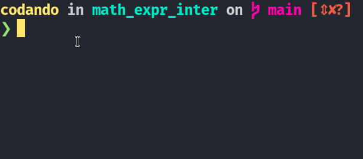
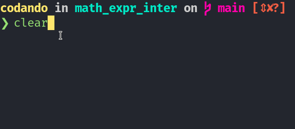

# Mathematical Expression Interpreter

Project to interpret mathematical expressions

## Requirements

- nodejs
- esy
- ocaml

## Installation

Clone the repository and install dependencies:

```bash
$ git clone https://github.com/joaolucasete/math_expr_inter.git
$ cd math_expr_inter
$ esy
```

## Usage

```shell
$ esy x math_expr_inter
1 + 2 + 3
// 6.00
```
### `Example 1`:

### `Example 2`:


## License

[MIT](https://choosealicense.com/licenses/mit/)

## acknowledgment
[Chiyoku](https://github.com/Chiyoku)
